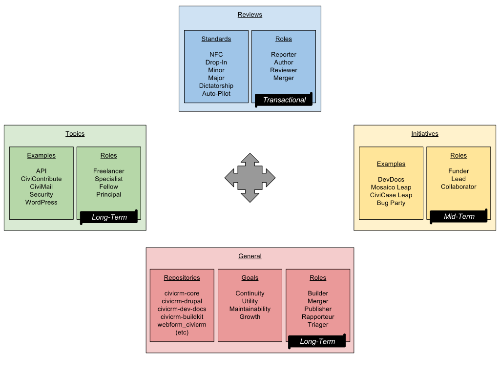

## Overview

What changes are accepted into CiviCRM?  Who decides?  How do you simultaneously scale the organization -- granting more authority to an
open group of contributors scartching their own itches -- while *also* ensuring that the overall direction remains cogent and serves the general interests?

This documentation lays out some key practices that have evolved to answer these questions.  It's verbose (several pages), but this
verbosity isn't intended to create new procedural overhead -- it mostly aims to provide *names* and *clarity* for previously informal
practices.

CiviCRM is a free/open-source application, which means that many developers have the power to write patches of their own initiative.  This
opens us up to a broad range of ideas and opportunities.  But patches are tricky business -- they can greatly improve the product, and they
can also cause unintended side-effects or disrupt other peoples' expectations.  We contain this risk through the [*Review*
process](/gov/reviews.md), which has a few basic tenents:

 * The *Review* process must involve more than one person. This mitigates the risk of biases and oversights. Each review
   involves a few *roles* (e.g. the author, the reviewer, the merger).
 * The *Review* difficulty should be proportionate.  For example, fixing a typo in a comment should be easy, but redesigning a major screen
   should require diligence (with respect to usability, continuity, documentation, etc).  This means we enforce different *review
   thresholds*.

We do **not** have a *thorough, objective, universal* standard for all possible changes -- writing, reading, or enforcing such a thing
would be a sisyphean task.  Instead, we use a short-cut: topical experience and trust.  Have you been publicly writing code or answering
questions about payment processors for the past year?  Then we're likely to trust your judgment when it comes to payment-processing.
Depending on the depth of your experience in the given [topic](/gov/topics.md), we trust you to authorize different kinds of changes:

 * A __Freelancer__ is trusted to authorize trivial, *non-functional* changes, such as cleaning up docblocks and code-style.
 * A [__Specialist__](/gov/playbook/specialist.md) is trusted to authorize *drop-in changes*, such as a clear-cut bugfix.
 * A [__Fellow__](/gov/playbook/fellow.md) is trusted to authorize *minor* changes, such as the addition of an API option.
 * A [__Principal__](/gov/playbook/principal.md) is trusted to authorize *major* changes, such as reorganizing a screen.

!!! tip "Development is open. Review authority is a checkbox."

    CiviCRM is open-source because *we want to empower a broad range of developers to implement their ideas*.  Anyone can write a patch for
    anything -- Freelancers can develop major changes, and Fellows can cleanup code-style.  However, as *one step in the process* toward
    mainstream distribution of the change, you'll need to get buy-in from someone entrusted with relevant authority.

...initiatives...

## Repositories

 * [https://github.com/civicrm/civicrm-backdrop](https://github.com/civicrm/civicrm-backdrop)
 * [https://github.com/civicrm/civicrm-core](https://github.com/civicrm/civicrm-core)
 * [https://github.com/civicrm/civicrm-drupal](https://github.com/civicrm/civicrm-drupal)
 * [https://github.com/civicrm/civicrm-joomla](https://github.com/civicrm/civicrm-joomla)
 * [https://github.com/civicrm/civicrm-packages](https://github.com/civicrm/civicrm-packages)
 * [https://github.com/civicrm/civicrm-wordpress](https://github.com/civicrm/civicrm-wordpress)
 * (And so on)

## Goals

 * __Continuity__: ...
 * __Utility__: ...
 * __Maintainability__: ...
 * __Growth__: ...

## Roles

The *general roles* are long-term, cross-cutting responsibilities.

 * [__Builder__](/gov/playbook/builder.md): At all times the Builder is responsible for the build/test/CI processes.
 * [__Merger__](/gov/playbook/merger.md): After a proposal is implemented and reviewed, the Merger accepts it into the canonical repository.
 * [__Publisher__](/gov/playbook/publisher.md): At the time of a release, the Publisher is responsible for the publication/distribution processes.
 * [__Rapporteur__](/gov/playbook/rapporteur.md): During the RC testing period, the Rapporteur reports a curated summary of changes in this release.
 * [__Triager__](/gov/playbook/triager.md): When a new issue is reported, the Triager is responsible for identifying the impacts and interested parties.

These roles are distinguished by their *time-sensitivity* and *process-orientation*.  For example:

 * If a test-failure slips into the main build, then it will interfere with *all* test and review activities.  The Builder should act quickly to
   resolve it -- his main responsibility is to *remove the roadblock*.  However, the specific action could be *reverting the causal
   change* or *writing a fix* or *notifying a topical expert* or *something else*.  That's a judgment call.
 * Many individuals have authority to review non-functional, drop-in, and minor changes -- but it would be pretty risky to give *all* of
   them merge rights.  Once a PR is reviewed, the Merger should act quickly to merge it and prevent staleness.  The Merger doesn't necessarily
   consider every aspect of the PR -- but they must check that sufficient testing/reviewing was done.
